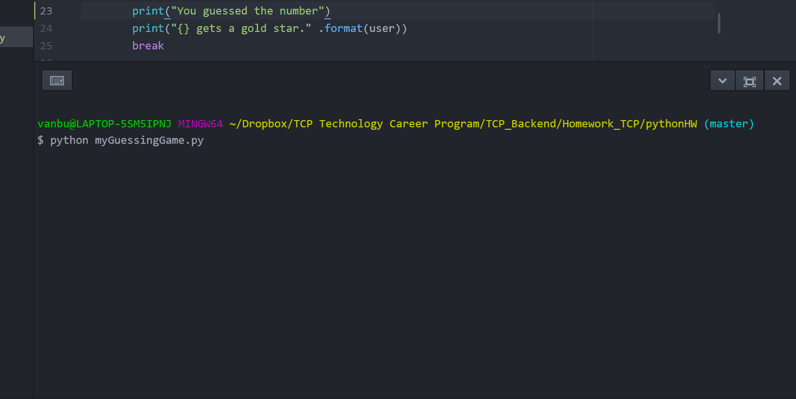

# The Guessing Game: An Experiment in Python

---

## User Story

```
As a user I want to play a guessing game created by python
so that I can play a guessing game for fun.
```



## Acceptance Criteria

**_Given_** that the user guesses a number starts the guessing game with a random number

**_When_** the user guesses a number the computer will give various hints if the number is too high or too low

**_Then_** when user guesses the correct number the computer will print the answer along with the number of attempts by the user

```
Validate the guessing game runs in python version 3.8.4
Validate the user has five attempts to guess the correct number
Validate the computer will generate a random number
```

---

## Homework Instructions

- Create `myGuessingGame.py` file
- Create a `GitHub` repo for your game
- Commit to `GitHub` at least five times
- Submit `.py` file and `GitHub` deployed link to Google classroom
- Use `python` module `random`
- Prompt user to enter their name
- Create variable named `number_of_guesses` and assign `0` to the variable
- Print a `string` that includes the players name
- Create a `while loop`
- Convert user input with `python's inbuilt int() method`

  - **_Hint_** use will use `random.randint` to randomize numbers
